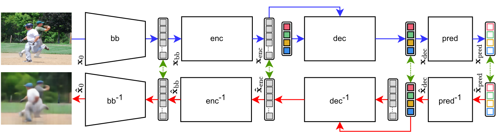

# Understanding Transformer-Based Vision Models via Modular Feature Inversion

[](https://openreview.net/forum?id=O5sMv2o3EV)
[](https://jmlr.org/tmlr/)
[](https://www.python.org/)
[](LICENSE)

Official implementation of the TMLR paper **Understanding Transformer-Based Vision Models via Modular Feature Inversion**.

This repository provides training and evaluation code for modular feature inversion in modern Transformer vision architectures. The method learns lightweight inverse modules that map internal representations back toward earlier representations or image space, enabling direct visual inspection of how information evolves across DETR, ViT, DeiT, and Swin Transformer models.



## Overview

Feature inversion is a useful lens for understanding what a neural representation preserves, discards, or transforms. Instead of training a single monolithic inverse model, this project studies a modular inversion pipeline: each inverse module targets one transition in the forward model. This makes inversion more scalable, and exposes stage-wise behavior.

The codebase includes:

- modular inverse networks for DETR backbone, encoder, decoder, and prediction head;
- modular inverse networks for ViT patch/backbone and encoder representations;
- inverse pipelines for Swin Transformer stages;
- parallel inverse-training baselines;
- fine-tuning scripts for DETR and ViT with mixed detection/classification and reconstruction objectives;

## Model Zoo


| Family | Module | Representation Inverted | Dataset | Checkpoint |
| --- | --- | --- | --- | --- |
| DETR | Inverse backbone | backbone embedding -> image | COCO 2017 | [Download DETR inverse backbone](https://github.com/wiskott-lab/inverse-tvm) |
| DETR | Inverse encoder | encoder embedding -> backbone embedding | COCO 2017 | [Download DETR inverse encoder](https://github.com/wiskott-lab/inverse-tvm) |
| DETR | Inverse decoder | decoder embedding -> encoder embedding | COCO 2017 | [Download DETR inverse decoder](https://github.com/wiskott-lab/inverse-tvm) |
| DETR | Inverse prediction head | DETR predictions -> decoder embedding | COCO 2017 | [Download DETR inverse prediction checkpoint](https://github.com/wiskott-lab/inverse-tvm) |
| ViT | Inverse backbone | patch/backbone embedding -> image | ImageNet-1k | [Download ViT inverse backbone](https://github.com/wiskott-lab/inverse-tvm) |
| ViT | Inverse encoder | encoder embedding -> patch/backbone embedding | ImageNet-1k | [Download ViT inverse encoder](https://github.com/wiskott-lab/inverse-tvm) |
| Swin | Modular inverse stages | stage features -> earlier features/image | ImageNet-1k | [Download Swin inverse stages](https://github.com/wiskott-lab/inverse-tvm) |
| Fine-tuned DETR | Inversion-aware DETR | detector with reconstruction objective | COCO 2017 | [Download fine-tuned DETR](https://github.com/wiskott-lab/inverse-tvm) |
| Fine-tuned ViT | Inversion-aware ViT | classifier with reconstruction objective | ImageNet-1k | [Download fine-tuned ViT](https://github.com/wiskott-lab/inverse-tvm) |

## Repository Layout

```text
inverse-tvm/
|-- config.py                     # Local paths and runtime configuration
|-- figures/                      # Paper/repository figures
|-- modules/
|   |-- detr/                     # DETR implementation used by the experiments
|   |-- inv_detr/                 # DETR inverse modules with individual, as well as modular, and end-to-end parallel training.
|   |   |-- inv_bb/
|   |   |-- inv_enc/
|   |   |-- inv_dec/
|   |   |-- inv_pred/
|   |   `-- parallel_training/
|   |-- inv_vit/                  # ViT inverse modules with individual, as well as modular, and end-to-end parallel training.
|   |   |-- inv_bb/
|   |   |-- inv_enc/
|   |   `-- parallel_training/
|   |-- inv_swin/                 # Swin inverse modules with individual, as well as modular, and end-to-end parallel training.
|   |-- finetuned_detr/           # DETR fine-tuning with reconstruction objectives
|   `-- finetuned_vit/            # ViT fine-tuning with reconstruction objectives
|-- tools/                        # Dataset, model, training, and logging utilities
|-- requirements.txt
`-- README.md
```

## Configuration

Before running experiments, update [config.py](config.py) with local dataset and output paths:

Expected COCO 2017 layout:

```text
coco/
|-- annotations/
|   |-- instances_train2017.json
|   `-- instances_val2017.json
|-- train2017/
`-- val2017/
```

ImageNet experiments support extracted class-folder splits:

```text
imagenet/
|-- train/
|   |-- n01440764/
|   `-- ...
`-- val/
    |-- n01440764/
    `-- ...
```

If extracted ImageNet split folders are not present, the loader falls back to `torchvision.datasets.ImageNet`.

## Quickstart

Train a DETR inverse backbone module:

```bash
python modules/inv_detr/inv_bb/train.py \
  --epochs 100 \
  --batch_size 32
```

Train a ViT inverse backbone module:

```bash
python modules/inv_vit/inv_bb/train.py \
  --epochs 100 \
  --batch_size 128
```

Each run creates a local directory under `RUNS_DIR/<experiment-id>/`. Use the printed experiment id as `--run_id` to resume a run or as `--inv_bb_id`, `--inv_enc_id`, and related arguments for downstream experiments.

## Training

### DETR Inversion

```bash
python modules/inv_detr/inv_bb/train.py --epochs 100 --batch_size 32
python modules/inv_detr/inv_enc/train.py --epochs 100 --batch_size 128
python modules/inv_detr/inv_dec/train.py --epochs 100
python modules/inv_detr/inv_pred/train.py --epochs 100 --batch_size 128
```

Parallel DETR inverse-training baselines:

```bash
python modules/inv_detr/parallel_training/modular_in_parallel.py
python modules/inv_detr/parallel_training/e2e_in_parallel.py
```

### ViT Inversion

```bash
python modules/inv_vit/inv_bb/train.py --epochs 100 --batch_size 128
python modules/inv_vit/inv_enc/train.py --epochs 100 --batch_size 128
```

Parallel ViT inverse-training baselines:

```bash
python modules/inv_vit/parallel_training/modular_in_parallel.py
python modules/inv_vit/parallel_training/e2e_in_parallel.py
```

### Swin Inversion

```bash
python modules/inv_swin/train.py --epochs 1000 --batch_size 128
python modules/inv_swin/parallel_training/modular_in_parallel.py
python modules/inv_swin/parallel_training/e2e_in_parallel.py
```

### Inversion-Aware Fine-Tuning

Fine-tune downstream models with reconstruction objectives from trained inverse modules:

```bash
python modules/finetuned_detr/train.py \
  --inv_bb_id <experiment-id> \
  --inv_enc_id <experiment-id> \
  --inv_dec_id <experiment-id> \
  --epochs 100 \
  --batch_size 16

python modules/finetuned_vit/train.py \
  --inv_bb_id <experiment-id> \
  --inv_enc_id <experiment-id> \
  --epochs 100 \
  --batch_size 512
```


## Local Logging

All experiments log locally through [tools/logging_utils.py](tools/logging_utils.py).

Each run is stored as:

```text
runs/<experiment-id>/
|-- config.json
|-- config.yaml
|-- metrics.jsonl
|-- checkpoints/
`-- model_states/
```
Checkpoints include model states, optimizer states, best validation loss, and training/evaluation step counters.

## Citation

If you use this repository or build on modular feature inversion, please cite the paper:

```bibtex
@article{modular_feature_inversion_2026,
  title = {Understanding Transformer-Based Vision Models via Modular Feature Inversion},
  journal = {Transactions on Machine Learning Research},
  year = {2026},
  author = {Rathjens, Jan and Reyhanian, Shirin and Kappel, David and Wiskott, Laurenz},
  url = {https://openreview.net/forum?id=O5sMv2o3EV}
}
```

## License

This repository is released under the license provided in [LICENSE](LICENSE).
